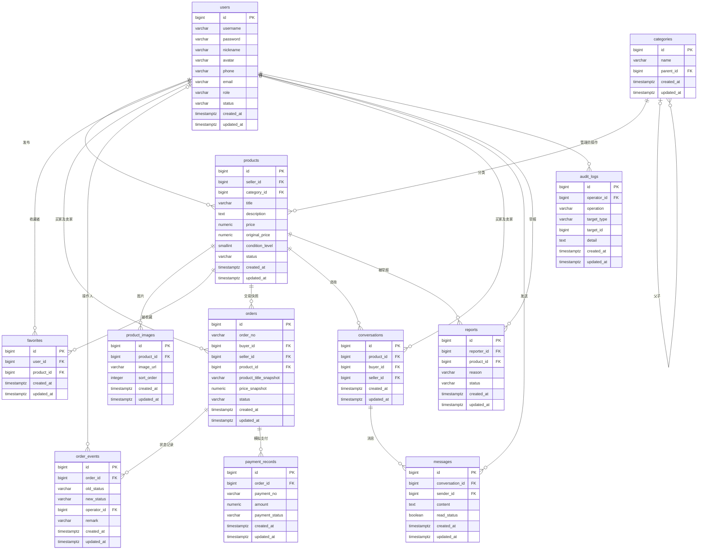

# ER 关系图

```mermaid
erDiagram
    users ||--o{ products : "发布"
    categories ||--o{ products : "分类"
    categories |o--o{ categories : "父子"
    products ||--o{ product_images : "图片"
    users ||--o{ favorites : "收藏者"
    products ||--o{ favorites : "被收藏"
    users ||--o{ orders : "买家及卖家"
    products ||--o{ orders : "交易快照"
    orders ||--o{ order_events : "状态记录"
    users |o--o{ order_events : "操作人"
    orders ||--o{ payment_records : "模拟支付"
    products ||--o{ conversations : "咨询"
    users ||--o{ conversations : "买家及卖家"
    conversations ||--o{ messages : "消息"
    users ||--o{ messages : "发送"
    users ||--o{ reports : "举报"
    products ||--o{ reports : "被举报"
    users ||--o{ audit_logs : "管理员操作"
    users {
        bigint id PK
        varchar username
        varchar password
        varchar nickname
        varchar avatar
        varchar phone
        varchar email
        varchar role
        varchar status
        timestamptz created_at
        timestamptz updated_at
    }
    categories {
        bigint id PK
        varchar name
        bigint parent_id FK
        timestamptz created_at
        timestamptz updated_at
    }
    products {
        bigint id PK
        bigint seller_id FK
        bigint category_id FK
        varchar title
        text description
        numeric price
        numeric original_price
        smallint condition_level
        varchar status
        timestamptz created_at
        timestamptz updated_at
    }
    product_images {
        bigint id PK
        bigint product_id FK
        varchar image_url
        integer sort_order
        timestamptz created_at
        timestamptz updated_at
    }
    favorites {
        bigint id PK
        bigint user_id FK
        bigint product_id FK
        timestamptz created_at
        timestamptz updated_at
    }
    orders {
        bigint id PK
        varchar order_no
        bigint buyer_id FK
        bigint seller_id FK
        bigint product_id FK
        varchar product_title_snapshot
        numeric price_snapshot
        varchar status
        timestamptz created_at
        timestamptz updated_at
    }
    order_events {
        bigint id PK
        bigint order_id FK
        varchar old_status
        varchar new_status
        bigint operator_id FK
        varchar remark
        timestamptz created_at
        timestamptz updated_at
    }
    conversations {
        bigint id PK
        bigint product_id FK
        bigint buyer_id FK
        bigint seller_id FK
        timestamptz created_at
        timestamptz updated_at
    }
    messages {
        bigint id PK
        bigint conversation_id FK
        bigint sender_id FK
        text content
        boolean read_status
        timestamptz created_at
        timestamptz updated_at
    }
    reports {
        bigint id PK
        bigint reporter_id FK
        bigint product_id FK
        varchar reason
        varchar status
        timestamptz created_at
        timestamptz updated_at
    }
    payment_records {
        bigint id PK
        bigint order_id FK
        varchar payment_no
        numeric amount
        varchar payment_status
        timestamptz created_at
        timestamptz updated_at
    }
    audit_logs {
        bigint id PK
        bigint operator_id FK
        varchar operation
        varchar target_type
        bigint target_id
        text detail
        timestamptz created_at
        timestamptz updated_at
    }
```

分类父级和系统事件操作人允许为空；其余关联为非空外键。日志目标为多态引用，未绘制虚假的外键关系。
